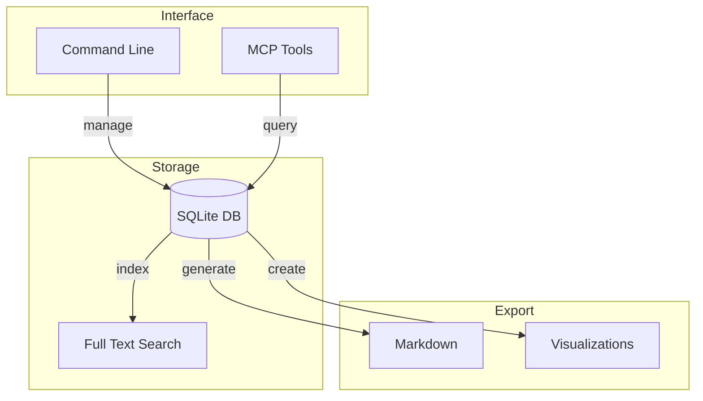
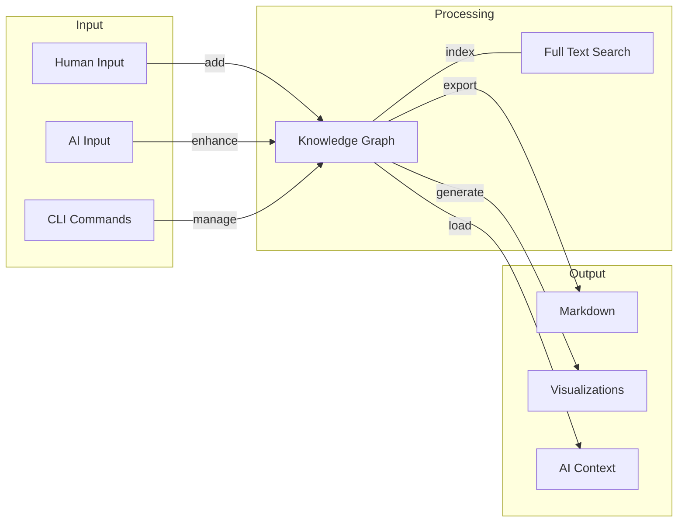
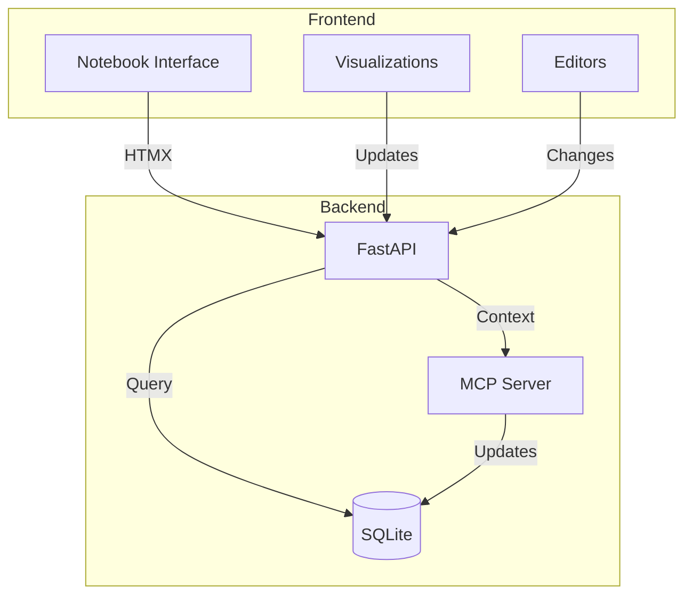

# basic-memory: Project Documentation

## Overview

basic-memory represents a fundamental shift in how humans and AI collaborate on projects. 
It combines the time-tested Zettelkasten note-taking method with modern knowledge graph technology and Anthropic's Model 
Context Protocol (MCP) to create something uniquely powerful: a system that both humans and AI can naturally work with, each in their own way.

Built on SQLite for simplicity and portability, basic-memory solves a critical challenge in AI-human collaboration: maintaining consistent, rich context across conversations while keeping information organized and accessible. It's like having a shared brain that both AI and humans can read and write to naturally.

Key innovations:
- **AI-Native Knowledge Structure**: Uses entities and relations that match how LLMs think
- **Human-Friendly Interface**: Everything is readable/writable as markdown text
- **Project Isolation**: Load only relevant context for focused discussions
- **Local-First**: Your knowledge stays in SQLite databases you control
- **Tool-Driven**: Leverages MCP for seamless AI interaction with your knowledge


Best of all, it provides simple, powerful tools that respect user agency and avoid vendor lock-in. 
No cloud dependencies, no black boxes - just a straightforward system for building shared understanding between humans and AI.

## Core Concepts

### Knowledge Graph Structure

#### Entities
Primary nodes in the knowledge graph. Each entity has:
- Unique name (identifier)
- Entity type (e.g., "person", "organization", "project")
- List of observations

Example:
```json
{
  "name": "Basic_Factory",
  "entityType": "Project",
  "observations": ["Collaborative development environment", "Uses MCP tools"]
}
```

#### Relations
Directed connections between entities, stored in active voice:
- From entity
- To entity
- Relation type

Example:
```json
{
  "from": "Basic_Memory",
  "to": "Basic_Machines",
  "relationType": "is_part_of"
}
```

#### Observations
Atomic facts about entities:
- Stored as strings
- Attached to specific entities
- Independent addition/removal
- One fact per observation

Example:
```json
{
  "entityName": "Basic_Memory",
  "observations": [
    "Uses SQLite for storage",
    "Supports project isolation",
    "Enables AI-human collaboration"
  ]
}
```

## Database Schema

```sql
-- Entities table
CREATE TABLE entities (
    name TEXT PRIMARY KEY,
    entity_type TEXT NOT NULL
);

-- Observations table
CREATE TABLE observations (
    id INTEGER PRIMARY KEY AUTOINCREMENT,
    entity_name TEXT REFERENCES entities(name),
    content TEXT NOT NULL,
    created_at DATETIME NOT NULL DEFAULT CURRENT_TIMESTAMP
);

-- Relations table
CREATE TABLE relations (
    id INTEGER PRIMARY KEY AUTOINCREMENT,
    from_entity TEXT REFERENCES entities(name),
    to_entity TEXT REFERENCES entities(name),
    relation_type TEXT NOT NULL,
    created_at DATETIME NOT NULL DEFAULT CURRENT_TIMESTAMP,
    UNIQUE(from_entity, to_entity, relation_type)
);

-- Full-text search
CREATE VIRTUAL TABLE entity_fts USING fts5(
    name,
    entity_type,
    observations_raw
);
```

## Project Management

### Database Structure
```
~/.basic-memory/
├── projects/
│   ├── basic-factory.db
│   ├── basic-memory.db
│   └── client-project.db
└── config.json
```

### CLI Commands
```bash
# Project management
basic-memory create project basic-factory
basic-memory switch project client-x
basic-memory list projects

# Entity management
basic-memory add entity "Basic_Memory" --type Project
basic-memory add observation "Basic_Memory" "Uses SQLite storage"
basic-memory add relation "Basic_Memory" "Basic_Machines" "is_part_of"
```

## MCP Tool Integration

### Tool Definitions
```json
{
  "tools": [
    {
      "name": "load_project",
      "description": "Load a project's knowledge graph into context",
      "parameters": {
        "type": "object",
        "properties": {
          "project_name": {
            "type": "string",
            "description": "Name of the project to load"
          }
        },
        "required": ["project_name"]
      }
    },
    {
      "name": "query_knowledge",
      "description": "Query the current project's knowledge graph",
      "parameters": {
        "type": "object",
        "properties": {
          "query": {
            "type": "string",
            "description": "Search query or entity name"
          }
        },
        "required": ["query"]
      }
    }
  ]
}
```

### Example Usage
```python
# In Claude chat
Human: Load the basic-factory project memory

Claude: Using load_project tool...
Result: Loaded 15 entities and 45 relations from basic-factory
```

```text
# In Claude chat
Human: What do we know about the Basic_Factory project?

Claude: Using query_knowledge tool...
Result: Found entity "Basic_Factory" with observations:
- Collaborative development environment
- Uses MCP tools for file and memory management
- Built with git integration capabilities
- Focuses on maintaining project context across sessions

Related entities:
- Basic_Machines (relation: is_part_of)
- Paul (relation: develops)
- MCP_Tools (relation: uses)
```

## Export Formats

### Markdown Export
```markdown
---
name: Basic_Factory
type: Project
created: 2024-02-27T10:30:00Z
---

[Observations]
- Collaborative development environment
- Uses MCP tools for file and memory management
- Built with git integration capabilities
- Focuses on maintaining project context across sessions

[Relations]
- Part of: [Basic_Machines](entity://Basic_Machines)
- Developed by: [Paul](entity://Paul)
- Uses: [MCP_Tools](entity://MCP_Tools)
```

## Implementation Roadmap

### Phase 1: Core Infrastructure
- SQLite database implementation
- Basic schema and FTS setup
- Project isolation framework
- Simple CLI interface

### Phase 2: MCP Integration
- MCP server implementation
- Tool definitions and handlers
- Context loading mechanisms
- Query interface

### Phase 3: Export/Import
- Markdown export
- Basic documentation generation
- Import from existing notes
- Batch operations

### Phase 4: Advanced Features (Future)
- Versioning using R-tree
- Extended metadata using JSON
- Advanced search capabilities
- Integration with other tools

## Business Model
1. **Core (Free)**
   - Local SQLite database
   - Basic knowledge graph functionality
   - Full-text search
   - Simple markdown export
   - Basic MCP tools

2. **Professional Features (Potential)**
   - Rich document export
   - Advanced versioning
   - Collaboration features
   - Custom integrations
   - Priority support

## Technical Dependencies
- SQLite (core database)
- FTS5 (full-text search)
- MCP Protocol (tool integration)
- Python (implementation language)

## Basic Machines Integration
- Complements basic-factory for AI collaboration
- Follows basic-components architecture principles
- Built on basic-foundation infrastructure
- Maintains DIY/punk philosophy of user control and transparency

## Key Principles
1. **Local First**: All data stored locally in SQLite
2. **Project Isolation**: Separate databases per project
3. **Human Readable**: Everything exportable to plain text
4. **AI Friendly**: Structure optimized for LLM interaction
5. **DIY Ethics**: User owns and controls their data
6. **Simple Core**: Start simple, expand based on needs
7. **Tool Integration**: MCP-based interaction model

## Future Considerations
1. **Versioning**: Track knowledge graph evolution
2. **Rich Metadata**: Extended attributes via JSON
3. **Advanced Search**: Complex query capabilities
4. **Multi-User**: Collaborative knowledge management
5. **API Integration**: Connect with other tools
6. **Visualization**: Graph visualization tools

## Community and Support
1. Open source core implementation
2. Public issue tracking
3. Community contributions welcome
4. Documentation and examples
5. Professional support options


2. **Project Architecture**


3. **Knowledge Flow**


These diagrams could be:
1. Generated automatically from the knowledge graph
2. Updated when the graph changes
3. Included in exports and documentation
4. Used for visualization in tools/UI

We could even add specific CLI commands:
```bash
basic-memory visualize relationships basic-factory
basic-memory visualize architecture
basic-memory visualize flow
```


# basic-memory-webui

## Overview
basic-memory-webui is a notebook-style interface for the basic-memory knowledge graph system, enabling interactive human-AI collaboration in knowledge work. 
It combines the power of Zettelkasten note-taking, knowledge graphs, and AI assistance into a unique local-first tool for thought.

### Why This is Cool and Interesting
This project represents a novel approach to human-AI collaboration by:
1. **True Two-Way Knowledge Flow**: Unlike traditional AI chat interfaces, both human and AI can read and write to the same knowledge graph, creating genuine collaborative intelligence
2. **Local-First Knowledge**: Your knowledge base lives in SQLite, not in some cloud service. It's yours to control, backup, and modify
3. **Notebook-Style Interface**: Familiar to developers but revolutionized with AI collaboration - imagine Jupyter Notebooks where cells can be knowledge graphs, markdown, or AI conversations
4. **MCP Integration**: Uses Anthropic's Model Context Protocol to give AI genuine understanding of context, not just simulated responses
5. **Basic Machines Stack**: Built on our proven stack (basic-foundation, basic-components), showing how simple tools can combine into powerful systems

## Architecture



## Core Features
1. **Notebook Interface**
   - Markdown cells
   - Knowledge graph visualizations
   - AI chat context
   - Interactive editing

2. **Knowledge Management**
   - Entity/relation viewing
   - Graph visualization
   - Tag organization
   - Full-text search

3. **AI Integration**
   - Context loading
   - Knowledge updates
   - Interactive chat to read/update notes
   - Memory persistence

4. **Data Management**
   - Local SQLite storage
   - Text export/import
   - Version control friendly
   - Backup support

## Technical Stack
- **Backend**: FastAPI, SQLite, MCP Tools
- **Frontend**: JinjaX, HTMX, Alpine.js, TailwindCSS
- **Components**: basic-components library
- **Infrastructure**: basic-foundation patterns

## Implementation Strategy

### Phase 1: Core Interface
- Basic notebook interface
- Markdown editing
- Simple knowledge graph viewing
- Basic MCP integration

### Phase 2: Rich Features
- Interactive graph visualization
- Advanced editing tools
- Real-time updates
- Enhanced AI collaboration

### Phase 3: Advanced Features
- Custom visualizations
- Extended search
- Knowledge analytics
- Export formats

## Development Approach
1. Start simple with core notebook interface
2. Add features iteratively
3. Focus on user experience
4. Maintain Basic Machines philosophy throughout

## Integration Points
1. **basic-memory**
   - Core knowledge graph
   - MCP server
   - Data storage

2. **basic-components**
   - UI components
   - Interactive elements
   - Styling system

3. **basic-foundation**
   - API patterns
   - Authentication (if needed)
   - Testing approach

## Future Possibilities
1. Multiple knowledge bases
2. Collaborative editing
3. Custom visualization plugins
4. Enhanced AI capabilities
5. Advanced graph analytics

## Future Enhancements

## Security & Privacy Features
For shared or hosted deployments, we plan to add:

1. **End-to-End Encryption**
   - Zero-knowledge encryption of knowledge base
   - Client-side key management
   - Secure sharing options
   - Support for team knowledge bases while maintaining privacy

2. **Access Control**
   - Personal encryption keys
   - Optional shared keys
   - Fine-grained permissions

These features will maintain our core principles:
- User owns their data
- Privacy by design
- No vendor lock-in
- Local-first philosophy

For now, we can focus on the core functionality:
1. Notebook interface
2. Knowledge graph
3. MCP integration
4. Local SQLite storage
