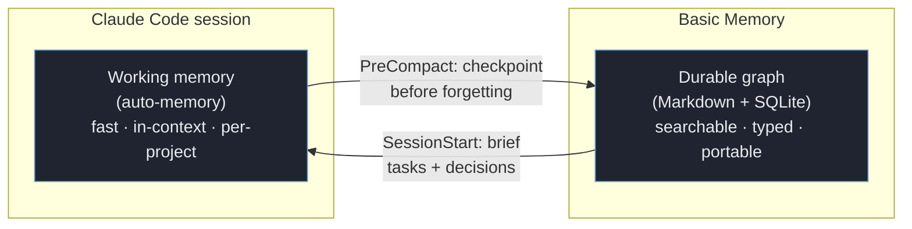
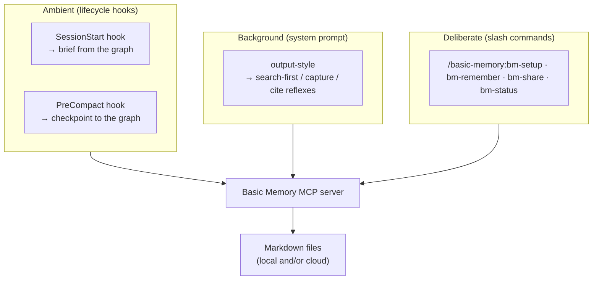
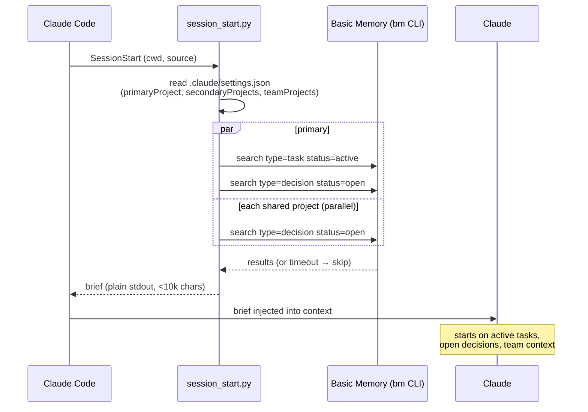
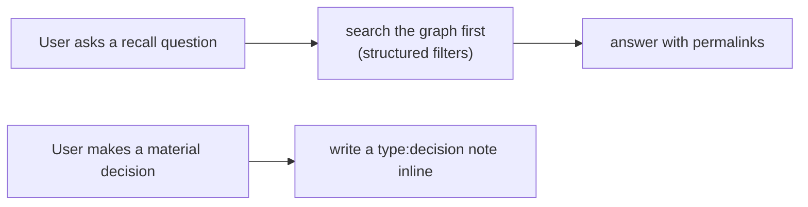
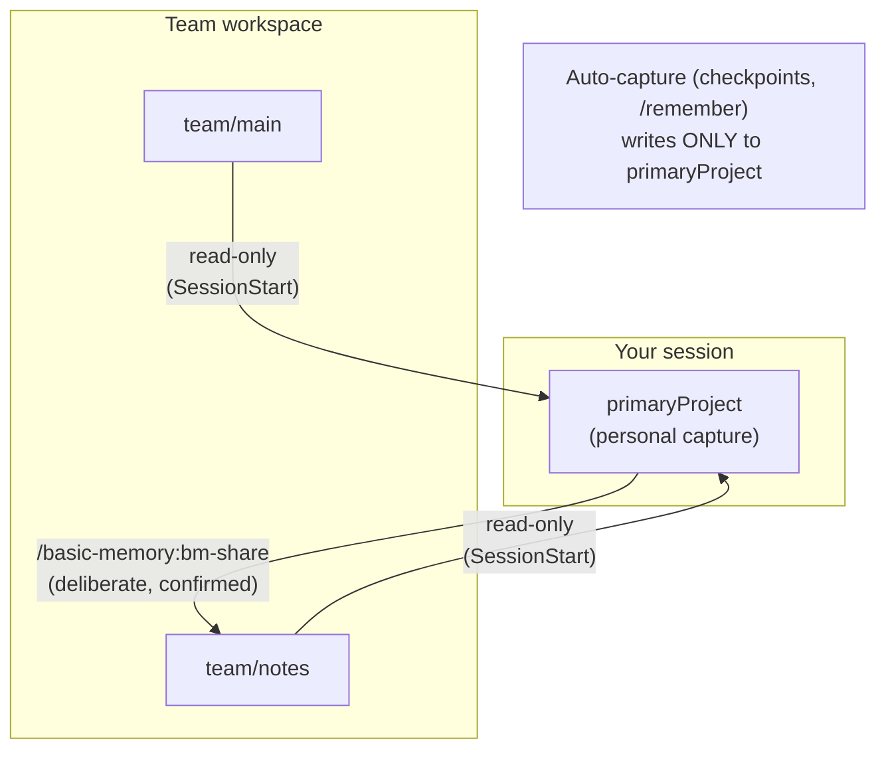

# Architecture

How the Basic Memory plugin works, flow by flow. For the design rationale and
decision history, see [DESIGN.md](../DESIGN.md).

## The bridge

Claude Code has its own **working memory** (auto-memory: short, in-context notes
Claude keeps per project). Basic Memory is a **durable graph** (Markdown files,
semantic + structured search, portable across tools). They do different jobs. The
plugin is the connective tissue that keeps each informed by the other.



The plugin ships **four surfaces**, in three layers:



Everything routes through the Basic Memory MCP server (and the `bm` CLI for the
hooks). The plugin itself holds no state — configuration lives in
`.claude/settings.json`, content lives in your Basic Memory projects.

## SessionStart — the brief

When a session begins, the hook puts the most relevant slice of the graph in front
of Claude *before the first prompt*, so the session starts oriented instead of cold.



Key properties:
- **Structured, not fuzzy.** Queries filter on `type`/`status` frontmatter, so recall
  is deterministic — exactly the active tasks and open decisions, not "things that
  look similar."
- **Parallel.** Primary and shared-project queries run concurrently; total wall-clock
  is ~one query, not the sum.
- **Best-effort.** No Basic Memory, no config, or a slow cloud read never blocks or
  errors the session — the worst case is a missing or partial brief.
- **First-run aware.** With no config it nudges toward `/basic-memory:bm-setup`.

## PreCompact — the checkpoint

Right before Claude Code compacts the context window (and the texture of the session
would be lost), the hook writes a durable checkpoint so the next session can resume.

```mermaid
sequenceDiagram
    participant CC as Claude Code
    participant H as pre_compact.py
    participant BM as Basic Memory

    CC->>H: PreCompact (transcript_path, cwd)
    H->>H: read settings → primaryProject
    alt no primaryProject configured
        H-->>CC: exit (never write un-opted-in)
    else configured
        H->>H: extract opening request + recent thread
        H->>BM: write_note type=session status=open<br/>→ primaryProject/sessions/
        BM-->>H: ok
    end
    Note over CC: compaction proceeds;<br/>checkpoint surfaces in the next<br/>SessionStart brief
```

The checkpoint is a schema-conforming `type: session` note, so the *next* session's
SessionStart query (`type=session`) finds it. Capture is extractive today; an
LLM-summarized version is the planned enrichment (PreCompact has a ~600s budget).

## Capture while you work

The opt-in output style turns three behaviors into reflexes during normal work — no
command needed:



Because decisions are captured **typed**, they show up in the next session's brief
automatically — the read and write sides reinforce each other.

## Teams — read across, share deliberately

On Basic Memory Cloud, the plugin reads team context into your brief but never
auto-writes to a shared project. Publishing back is always a manual gesture.



Team refs are workspace-qualified (`team/notes`) or `external_id` UUIDs, because
project names collide across workspaces. Reads route over the user's OAuth session.

## Where things live

| Path | Role |
|------|------|
| `hooks/session_start.py`, `hooks/pre_compact.py` | the ambient bridge (read / write) |
| `hooks/hooks.json` | registers the hooks |
| `output-styles/basic-memory.md` | the capture reflexes |
| `skills/{bm-setup,bm-remember,bm-share,bm-status}/` | the deliberate slash commands |
| `schemas/{session,decision,task}.md` | picoschema seeds (copied into your project at setup) |
| `.claude/settings.json` → `basicMemory` | per-project configuration |
| your Basic Memory projects | all actual content |
