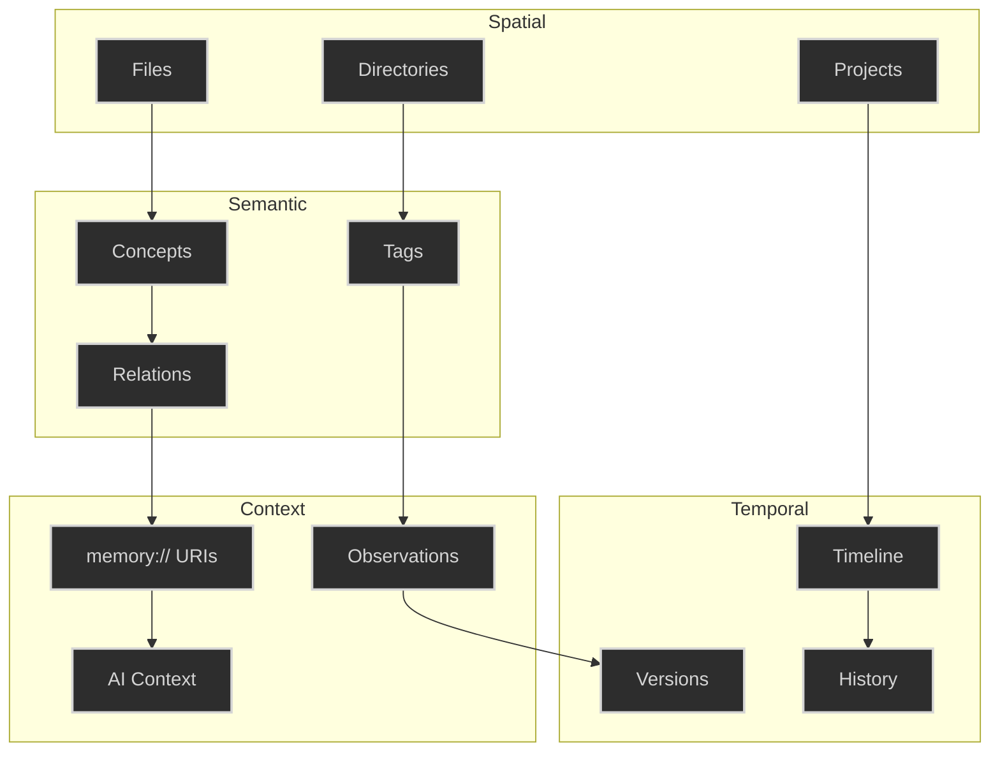
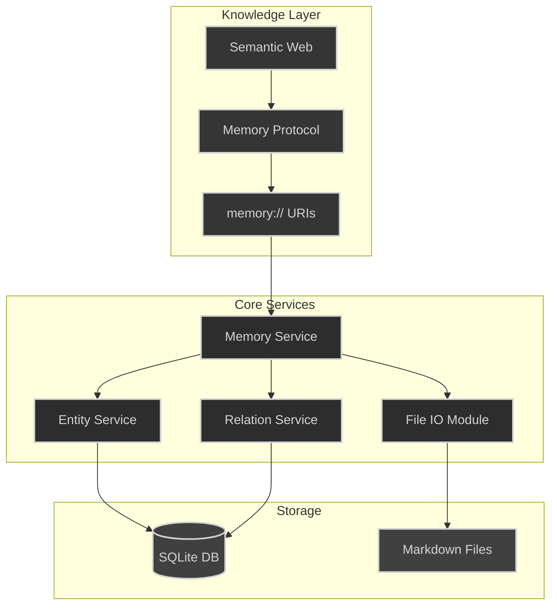
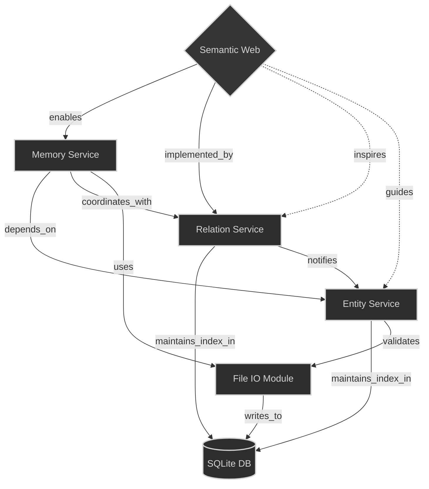
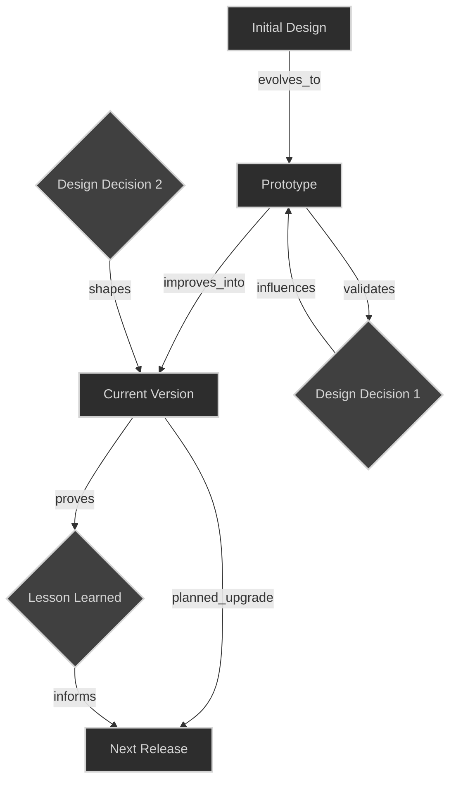
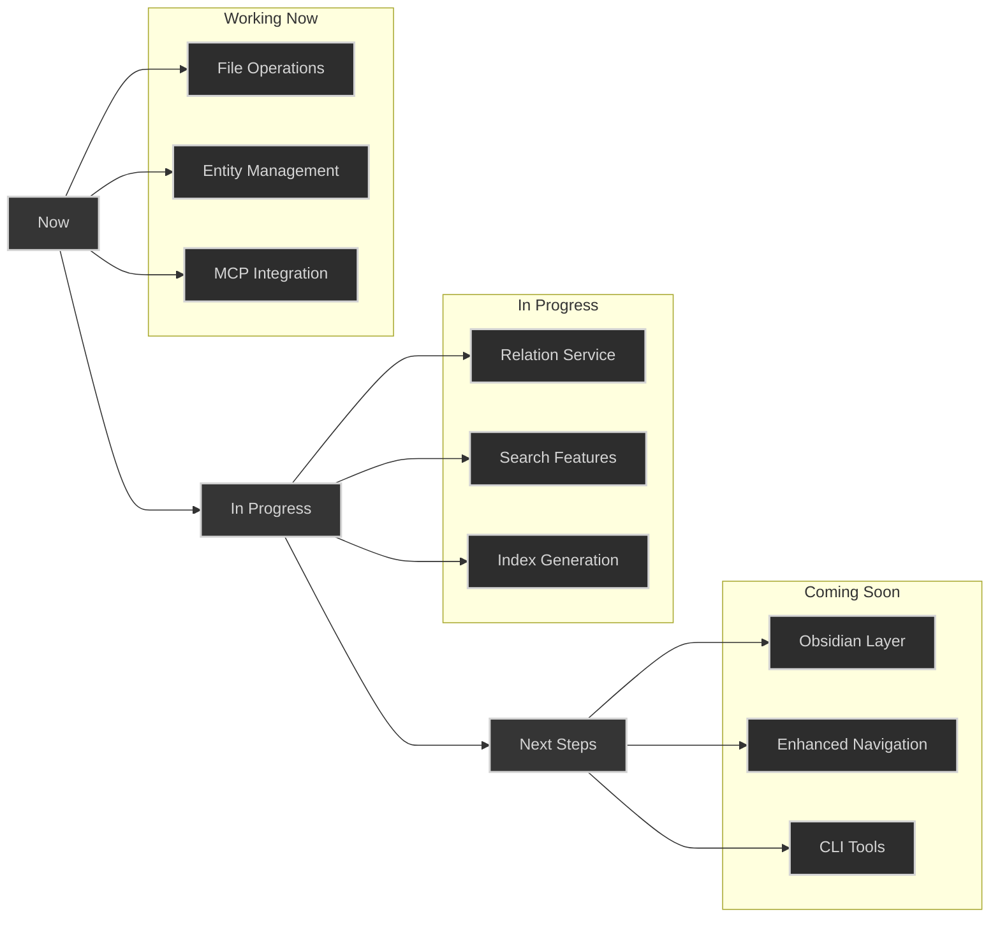

# Basic Memory: Tools for Better Thinking

> Built on open standards, powered by proven technology, ready for the future of human-AI collaboration.

Basic Memory is an open source knowledge management system that lets you capture and explore information the way your brain naturally works - across multiple dimensions and perspectives.

## The Problem We're Solving

Current knowledge management tools force you to choose: hierarchical folders OR flat files, tags OR categories, local OR cloud storage. But real knowledge doesn't work that way. Ideas connect across multiple dimensions, linking and building in organic ways.

This becomes even more critical when working with AI. Every chat starts fresh, context gets lost, and your growing knowledge stays trapped in random conversation logs.

Imagine your AI conversations automatically organizing themselves into a beautiful, navigable knowledge base. That's what Basic Memory + Obsidian delivers.

### What It Does

- Your AI interactions create structured markdown files
- Obsidian automatically turns these into visual knowledge graphs
- Auto-generated indexes give you multiple ways to explore
- Everything stays local and human-readable on your machine
  
## The Vision  
  
Basic Memory combines three powerful ideas:  
1. Semantic web's structured knowledge  
2. Local-first human readable storage  
3. AI's natural language understanding  
  
This creates a system where:  
- Humans write naturally in Obsidian  
- AI understands and navigates the knowledge  
- Everything is linked and discoverable  
- Knowledge grows organically
### Why It's Different

- No more lost context between AI chats
- See connections you wouldn't otherwise notice
- Navigate your knowledge visually
- Keep working in familiar Obsidian interface
- AI becomes a natural part of your thought process
## Our Approach

Basic Memory lets knowledge exist naturally in multiple dimensions:
- **Spatial**: Navigate through folder hierarchies when that makes sense
- **Semantic**: Follow relationship graphs between concepts
- **Temporal**: Track how ideas evolve over time
- **Contextual**: Jump directly to related knowledge through semantic links

Built on our core principles:
- **Local First**: Your knowledge stays in SQLite databases you control
- **Open Format**: Everything stored as human-readable markdown
- **DIY Philosophy**: Simple tools that respect user agency
- **True Open Source**: AGPL3 licensed - share, modify, improve

## Key Features

1. **Multidimensional Organization**
   - Use folders AND graphs AND timelines
   - Every piece of knowledge accessible from multiple angles
   - Natural organization that grows with use

2. **Rich Context**
   - Semantic linking between related concepts
   - Automatic indexes and navigation aids
   - Full history and evolution tracking

3. **AI-Ready Architecture**
   - Persistent context across conversations
   - Natural knowledge building through use
   - Semantic addressing for precise recall

4. **Obsidian Integration**
   - Beautiful visualization of knowledge graphs
   - Familiar interface for note-taking
   - No vendor lock-in

## Real-World Example  
  
### 1. Human Writes in Obsidian  
```markdown  
# Basic Memory Sync Implementation  
Working on implementing file sync between Obsidian and our knowledge graph.  
  
## ApproachConsidering watchdog for file monitoring...  
  
## Questions- How to handle conflicts?  
- What about concurrent edits?  
  
[[memory://basic-memory/file-operations]] needs_update  
[[memory://basic-memory/sync-strategy]] implements  
```  
  
### 2. AI Builds Context  
```python  
async def build_context(chat_uri: str) -> Context:  
    # Load current chat    
    chat = await load_entity(chat_uri)        
    
    # Followlinks to understand context  
    file_ops = await load_entity("memory://basic-memory/file-operations")
    sync_strategy = await load_entity("memory://basic-memory/sync-strategy")        
    # Find related discussions  
    related = await search_entities("sync AND conflicts")        
    return Context(chat, file_ops, sync_strategy, related)  
```  
  
### 3. AI Responds with Context  

>"I see you're working on file sync. Based on our previous discussion in [[memory://chats/20241205-sync-design]], we decided to handle conflicts by... Looking at [[memory://basic-memory/file-operations]], we'll need to update the atomic write operations to..."

## Why This Matters

Knowledge shouldn't be trapped in rigid structures or locked away in proprietary formats. Basic Memory gives you tools to capture and explore ideas the way your brain actually works - making connections, following threads, and building understanding across dimensions.

Perfect for:
- Researchers tracking complex projects
- Developers managing technical knowledge
- Writers organizing ideas and sources
- Anyone collaborating deeply with AI

## Getting Started

Basic Memory is open source (AGPL3) and ready for:
- Individual use (free forever)
- Team adoption (commercial licensing available)
- Custom integration (contact us)

# Part 2: Technical Innovation

## The Big Picture: A Semantic Bridge

Basic Memory represents a fundamental breakthrough in knowledge management: it creates a seamless bridge between human-friendly note organization and machine-understandable semantic structures. While this might sound abstract, the implementation is beautifully practical.

### Knowledge That Works Like Your Brain
Just as your mind can approach ideas from multiple angles, Basic Memory enables natural movement between different dimensions of knowledge:



### Semantic Addressing
This multidimensional structure becomes navigable through our memory:// URI scheme:

```markdown
# Direct Knowledge Access
memory://basic-memory/concepts/semantic-web         # Single concept
memory://project-x/decisions/2024-01-design        # Specific decision

# Pattern-Based Views
memory://*/technical/*.md                          # All technical docs
memory://basic-memory/decisions/2024*              # All 2024 decisions

# Smart Context Loading
memory://basic-memory/context/last-3-days          # Recent context
memory://*/related-to/current-task                 # Task-related content
```

This creates a system where:
- Humans can work naturally in their preferred dimension (files, graphs, links)
- AIs can traverse the semantic structure programmatically
- Knowledge remains accessible from any perspective
- Connections build and strengthen through use

### AI Integration Through MCP
The memory:// URIs enable seamless AI interaction by:
1. Providing precise context loading
2. Maintaining conversation history
3. Enabling semantic queries
4. Preserving knowledge relationships

When an AI needs context, it can:
```python
# Example context loading
if uri.startswith('memory://'):
    context = memory_service.load_context(
        project = 'basic-memory',
        path = 'concepts/semantic-web',
        include_relations = True
    )
```


## Core Architecture

### Local-First Knowledge Storage
- **SQLite Database**: Fast, reliable, and portable storage
- **Markdown Files**: Human-readable text files as source of truth
- **Two-Way Sync**: Changes in either files or database propagate automatically
- **Project Isolation**: Separate databases keep contexts clean and portable

### Intelligent File Organization
- **Smart Folder Structure**: Organize by project, type, or timeline
- **Auto-Generated Indexes**: Dynamic views of your knowledge
  - Technical component listings
  - Project status dashboards
  - Timeline views
  - Recent changes logs
- **Rich Metadata**: Frontmatter provides context without cluttering content




## Obsidian Integration: The Human Interface

### Visual Knowledge Navigation
Obsidian provides:
- Interactive graph visualization
- Wiki-style navigation
- Familiar markdown editing
- Full-text search

### Two-Way Sync
- Files editable in Obsidian or programmatically
- Database stays in sync with files
- Changes propagate automatically
- History preserved through git

### Knowledge Graph with Relations


---

# Part 3: Implementation Examples

## Project Structure
```
basic-memory/
├── indexes/          # Auto-generated navigation aids
│   ├── technical-components.md
│   ├── project-status.md
│   └── weekly-updates.md
├── entities/         # Core knowledge storage
│   ├── technical/
│   │   ├── memory-service.md
│   │   └── entity-service.md
│   ├── concepts/
│   │   └── semantic-web.md
│   └── projects/
│       └── basic-memory.md
├── decisions/        # Design history
│   └── 20241210-file-structure.md
└── conversations/    # AI interaction records
    └── 20241210-semantic-web-breakthrough.md
```

## Knowledge Representation

### Entity Document Example
```markdown
---
type: technical_component
created: 2024-12-10T15:30:00Z
updated: 2024-12-10T16:45:00Z
status: implementing
tags: [core, service, memory]
---

# Memory Service

Core service handling knowledge persistence and retrieval.

## Description
Provides unified interface for storing and accessing knowledge.

## Observations
- Implements filesystem-as-source-of-truth pattern
- Handles atomic file operations
- Maintains SQLite index

## Relations
- [[Entity_Service]] depends_on
- [[File_IO_Module]] uses

## References
- memory://basic-memory/decisions/20241210-file-structure
```

### Auto-Generated Index Example
```markdown
---
type: index
indexType: technical_components
generated: 2024-12-10T17:00:00Z
autoUpdate: true
---

# Technical Components

## Core Services
- [[Memory_Service]] - Knowledge persistence
- [[Entity_Service]] - Entity lifecycle
- [[Relation_Service]] - Relationships

## Recent Updates
- Added observation support (2024-12-10)
- Improved error handling (2024-12-09)

## Implementation Status
- ✅ Core file operations
- 🚧 Relation handling
- 📋 Advanced search
```

### Visualize Temporal Knowledge




# Current Status & Next Steps


## Implemented
- Core file operations and database sync
- Basic entity and relation management
- Markdown file format and parsing
- SQLite schema and indexing
- Initial MCP integration

## In Progress
- Relation service completion
- Enhanced search capabilities
- Index generation improvements
- Documentation updates

## Coming Soon
- Obsidian compatibility layer
- Enhanced navigation features
- Improved AI context building
- CLI tool suite for managing AI sync

## Get Involved
Basic Memory is open source (AGPL3) and ready for:
- Community Edition: Free, open source for technical users
- Personal Edition: Easy-to-use desktop app for everyone
- Team Edition: Secure collaboration for groups

Every edition maintains our core principle: your knowledge stays yours.

Built with ♥️ by Basic Machines. Join us in building tools for better thinking at basic-machines.co