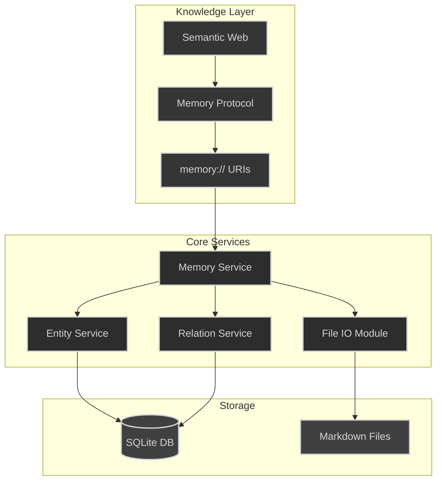

# Basic Memory: Knowledge That Works Like Your Brain

Basic Memory is an open source knowledge management system that lets you capture and explore information the way your brain naturally works - across multiple dimensions and perspectives.

## The Problem We're Solving

Current knowledge management tools force you to choose: hierarchical folders OR flat files, tags OR categories, local OR cloud storage. But real knowledge doesn't work that way. Ideas connect across multiple dimensions, linking and building in organic ways.

This becomes even more critical when working with AI. Every chat starts fresh, context gets lost, and your growing knowledge stays trapped in random conversation logs.

## Our Approach

Basic Memory lets knowledge exist naturally in multiple dimensions:
- **Spatial**: Navigate through folder hierarchies when that makes sense
- **Semantic**: Follow relationship graphs between concepts
- **Temporal**: Track how ideas evolve over time
- **Contextual**: Jump directly to related knowledge through semantic links

Built on our core principles:
- **Local First**: Your knowledge stays in SQLite databases you control
- **Open Format**: Everything stored as human-readable markdown
- **DIY Philosophy**: Simple tools that respect user agency
- **True Open Source**: AGPL3 licensed - share, modify, improve

## Key Features

1. **Multidimensional Organization**
   - Use folders AND graphs AND timelines
   - Every piece of knowledge accessible from multiple angles
   - Natural organization that grows with use

2. **Rich Context**
   - Semantic linking between related concepts
   - Automatic indexes and navigation aids
   - Full history and evolution tracking

3. **AI-Ready Architecture**
   - Persistent context across conversations
   - Natural knowledge building through use
   - Semantic addressing for precise recall

4. **Obsidian Integration**
   - Beautiful visualization of knowledge graphs
   - Familiar interface for note-taking
   - No vendor lock-in

## Why This Matters

Knowledge shouldn't be trapped in rigid structures or locked away in proprietary formats. Basic Memory gives you tools to capture and explore ideas the way your brain actually works - making connections, following threads, and building understanding across dimensions.

Perfect for:
- Researchers tracking complex projects
- Developers managing technical knowledge
- Writers organizing ideas and sources
- Anyone collaborating deeply with AI

## Getting Started

Basic Memory is open source (AGPL3) and ready for:
- Individual use (free forever)
- Team adoption (commercial licensing available)
- Custom integration (contact us)

Built with ♥️ by the Basic Machines collective. Let's enhance human understanding together.

---
Built on open standards, powered by proven technology, ready for the future of human-AI collaboration.
---

# Technical Innovation Overview

## The Big Picture: A Semantic Bridge

Basic Memory represents a fundamental breakthrough in knowledge management: it creates a seamless bridge between human-friendly note organization and machine-understandable semantic structures. While this might sound abstract, the implementation is beautifully practical.

## Core Architecture

### Local-First Knowledge Storage
- **SQLite Database**: Fast, reliable, and portable storage
- **Markdown Files**: Human-readable text files as source of truth
- **Two-Way Sync**: Changes in either files or database propagate automatically
- **Project Isolation**: Separate databases keep contexts clean and portable

### Intelligent File Organization
- **Smart Folder Structure**: Organize by project, type, or timeline
- **Auto-Generated Indexes**: Dynamic views of your knowledge
  - Technical component listings
  - Project status dashboards
  - Timeline views
  - Recent changes logs
- **Rich Metadata**: Frontmatter provides context without cluttering content

## The Semantic Layer

### memory:// URI Scheme
Think of this like "web addresses for your knowledge." Just as http:// links connect web pages, memory:// URIs connect pieces of knowledge:

```
memory://basic-memory/concepts/semantic-web    # Direct concept reference
memory://*/technical-components               # Cross-project view
memory://current/recent-changes               # Timeline-based access
memory://project-x/decisions/*                # Pattern-based queries
```

This creates a "semantic web" of your personal knowledge where:
- Every piece of information is directly addressable
- Patterns can match related concepts
- Knowledge can be traversed programmatically
- References work across projects and contexts

### Context Building
The system can automatically build rich context by:
1. Following semantic links to related concepts
2. Understanding relationship types and their meaning
3. Aggregating relevant information across projects
4. Maintaining historical context through versions

## AI Integration (MCP)

### Model Context Protocol
Basic Memory implements Anthropic's Model Context Protocol (MCP), enabling:
- AI tools that can navigate your knowledge graph
- Persistent context across conversations
- Structured data exchange with AI models
- Tool-based interaction with your knowledge base

### Smart Context Loading
When an AI needs context, the system can:
1. Parse memory:// URIs to locate relevant knowledge
2. Follow semantic links to related concepts
3. Build appropriate context summaries
4. Maintain conversation history with proper references

## Obsidian Integration

### Two-Way Compatibility
- **Files**: Standard markdown with frontmatter metadata
- **Links**: Wiki-links map to semantic relationships
- **Graphs**: Automatic visualization of knowledge connections
- **Search**: Full-text and semantic search capabilities

### Enhanced Navigation
- **Auto-Generated Indexes**: Dynamic directory of knowledge
- **Smart Lists**: Automatically updated views of related content
- **Timeline Views**: Track knowledge evolution
- **Status Boards**: Project and component tracking

### Preservation of Intent
- Human notes remain human-readable
- AI interactions maintain context
- Semantic connections preserve meaning
- All data stays in open formats

## The Technical Innovation

What makes Basic Memory special is how these components work together:

1. **Knowledge Capture**
   - Write normally in Obsidian
   - System maintains semantic structure
   - Connections build automatically
   - Context preserves naturally

2. **Knowledge Organization**
   - Multiple simultaneous organizations
   - Automatic index generation
   - Semantic relationship tracking
   - Timeline preservation

3. **Knowledge Access**
   - Direct through memory:// URIs
   - Visual through Obsidian graphs
   - Semantic through AI tools
   - Temporal through history tracking

4. **Knowledge Evolution**
   - Natural growth through use
   - Automatic relationship discovery
   - Context building across sessions
   - Pattern emergence over time

## Implementation Philosophy

The system follows key principles:

1. **Source of Truth**
   - Markdown files are authoritative
   - Database serves as queryable index
   - All operations are atomic and safe
   - Recovery is always possible

2. **Open Standards**
   - Standard markdown format
   - SQLite database
   - URI-based addressing
   - Git-compatible storage

3. **Local Control**
   - All data stays local
   - No cloud dependencies
   - Standard backup options
   - Easy data portability

4. **Extensibility**
   - Clear API boundaries
   - Standard protocols
   - Pluggable components
   - Open source core

## Future Capabilities

The architecture enables future features like:

1. **Enhanced Semantics**
   - Relationship type inference
   - Automatic categorization
   - Pattern discovery
   - Knowledge graph analytics

2. **Advanced AI Integration**
   - Custom tool development
   - Specialized context builders
   - Pattern-based queries
   - Semantic search enhancement

3. **Collaborative Features**
   - Shared knowledge bases
   - Team synchronization
   - Access control
   - Audit trails

4. **Extended Tooling**
   - Custom visualizations
   - Analysis tools
   - Export formats
   - Integration APIs

## Why This Matters

Basic Memory isn't just another note-taking app or knowledge base. It's a fundamental rethinking of how personal knowledge can be:
- Captured without friction
- Organized without overhead
- Accessed naturally
- Enhanced through AI interaction
- Preserved for the long term

By creating a semantic layer that works equally well for humans and machines, while keeping everything local and under user control, we're building infrastructure for a new kind of personal knowledge management.

This is what makes it truly powerful: it enhances how you already work while enabling entirely new capabilities through its semantic understanding layer.


# Basic Memory: Practical Examples

## Project Structure Example
```
basic-memory/
├── indexes/
│   ├── technical-components.md
│   ├── project-status.md
│   ├── weekly-updates.md
│   └── design-decisions.md
├── entities/
│   ├── technical/
│   │   ├── memory-service.md
│   │   ├── entity-service.md
│   │   └── relation-service.md
│   ├── concepts/
│   │   ├── semantic-web.md
│   │   └── memory-protocol.md
│   └── projects/
│       ├── basic-memory.md
│       └── obsidian-integration.md
├── decisions/
│   ├── 20241210-file-structure.md
│   └── 20241210-obsidian-format.md
└── conversations/
    └── 20241210-semantic-web-breakthrough.md
```

## Example Entity Document
```markdown
---
type: technical_component
created: 2024-12-10T15:30:00Z
updated: 2024-12-10T16:45:00Z
status: implementing
tags: [core, service, memory]
---

# Memory Service

Core service handling knowledge persistence and retrieval.

## Description
Provides unified interface for storing and accessing knowledge across filesystem and database, maintaining consistency and enabling semantic queries.

## Observations
- Implements filesystem-as-source-of-truth pattern
- Handles atomic file operations
- Maintains SQLite index
- Coordinates with entity and relation services

## Relations
- [[Entity_Service]] depends_on
- [[Relation_Service]] coordinates_with
- [[File_IO_Module]] uses
- [[SQLite_Schema]] implements

## Implementation Notes
- Uses async/await throughout
- Careful error handling for filesystem operations
- Proper SQLite transaction management
- Full test coverage

## References
- memory://basic-memory/decisions/20241210-file-structure
- memory://basic-memory/concepts/semantic-web
```

## Example Index Document
```markdown
---
type: index
indexType: technical_components
generated: 2024-12-10T17:00:00Z
autoUpdate: true
---

# Technical Components

## Core Services
- [[Memory_Service]] - Knowledge persistence and retrieval
- [[Entity_Service]] - Entity lifecycle management
- [[Relation_Service]] - Relationship handling

## Supporting Modules
- [[File_IO_Module]] - Atomic file operations
- [[Database_Service]] - SQLite management
- [[Index_Generator]] - Navigation aid creation

## Recent Updates
- Added observation support to Memory Service (2024-12-10)
- Improved error handling in File IO Module (2024-12-09)
- New index generation patterns (2024-12-08)

## Implementation Status
- ✅ Core file operations
- ✅ Entity management
- 🚧 Relation handling
- 📋 Advanced search

## Related Concepts
- [[Semantic_Web]]
- [[Memory_Protocol]]
- [[File_Structure_Design]]
```


# Basic Memory: Practical Examples

## Project Structure Example
```
basic-memory/
├── indexes/
│   ├── technical-components.md
│   ├── project-status.md
│   ├── weekly-updates.md
│   └── design-decisions.md
├── entities/
│   ├── technical/
│   │   ├── memory-service.md
│   │   ├── entity-service.md
│   │   └── relation-service.md
│   ├── concepts/
│   │   ├── semantic-web.md
│   │   └── memory-protocol.md
│   └── projects/
│       ├── basic-memory.md
│       └── obsidian-integration.md
├── decisions/
│   ├── 20241210-file-structure.md
│   └── 20241210-obsidian-format.md
└── conversations/
    └── 20241210-semantic-web-breakthrough.md
```

## Example Entity Document
```markdown
---
type: technical_component
created: 2024-12-10T15:30:00Z
updated: 2024-12-10T16:45:00Z
status: implementing
tags: [core, service, memory]
---

# Memory Service

Core service handling knowledge persistence and retrieval.

## Description
Provides unified interface for storing and accessing knowledge across filesystem and database, maintaining consistency and enabling semantic queries.

## Observations
- Implements filesystem-as-source-of-truth pattern
- Handles atomic file operations
- Maintains SQLite index
- Coordinates with entity and relation services

## Relations
- [[Entity_Service]] depends_on
- [[Relation_Service]] coordinates_with
- [[File_IO_Module]] uses
- [[SQLite_Schema]] implements

## Implementation Notes
- Uses async/await throughout
- Careful error handling for filesystem operations
- Proper SQLite transaction management
- Full test coverage

## References
- memory://basic-memory/decisions/20241210-file-structure
- memory://basic-memory/concepts/semantic-web
```

## Example Index Document

- The AI writes records information in plain text markdown. 
- Files can also be edited by the user.

```markdown
---
type: index
indexType: technical_components
generated: 2024-12-10T17:00:00Z
autoUpdate: true
---

# Technical Components

## Core Services
- [[Memory_Service]] - Knowledge persistence and retrieval
- [[Entity_Service]] - Entity lifecycle management
- [[Relation_Service]] - Relationship handling

## Supporting Modules
- [[File_IO_Module]] - Atomic file operations
- [[Database_Service]] - SQLite management
- [[Index_Generator]] - Navigation aid creation

## Recent Updates
- Added observation support to Memory Service (2024-12-10)
- Improved error handling in File IO Module (2024-12-09)
- New index generation patterns (2024-12-08)

## Implementation Status
- ✅ Core file operations
- ✅ Entity management
- 🚧 Relation handling
- 📋 Advanced search

## Related Concepts
- [[Semantic_Web]]
- [[Memory_Protocol]]
- [[File_Structure_Design]]
```

## Semantic Web Visualization

- The AI can easily produce visualizations of related data in memory.



## Enhanced Navigation Examples

This structure enables multiple ways to navigate and understand the knowledge base:
- Directory structure for traditional navigation
- Wiki-links for relationship exploration
- Status boards for project tracking
- Timeline views for historical context
- Component views for technical understanding

Each view is auto-generated and updated, ensuring information stays current while maintaining the core principle of markdown files as the source of truth.

1. **Timeline View** (`indexes/weekly-updates.md`):
```markdown
# Weekly Development Updates

## Week of 2024-12-10
### New Features
- [[Memory_Service]] Added observation support
- [[File_IO_Module]] Improved error handling

### Key Decisions
- [[20241210-file-structure]] Finalized directory organization
- [[20241210-obsidian-format]] Standardized markdown format

### In Progress
- [[Relation_Service]] Implementing core functionality
- [[Search_Module]] Designing advanced queries
```

2. **Component Status** (`indexes/technical-components.md`):
```markdown
# Technical Components Status

## Active Development
🚧 [[Relation_Service]]
- Implementing core functionality
- Adding validation rules
- Writing tests

## Recently Completed
✅ [[Memory_Service]]
- Added observation support
- Improved error handling
- Full test coverage

## Up Next
📋 [[Search_Module]]
- Design query language
- Implement basic search
- Add advanced filters
```

3. **Project Overview** (`indexes/project-status.md`):
```markdown
# Project Status Overview

## Current Focus
- Implementing relation management
- Improving search capabilities
- Documentation updates

## Recent Progress
### Technical
- Core services stable
- File operations reliable
- Basic search working

### Documentation
- Architecture guide updated
- API documentation current
- Example files created

## Next Steps
1. Complete relation service
2. Enhance search functionality
3. Add visualization tools
4. Improve error handling
```


